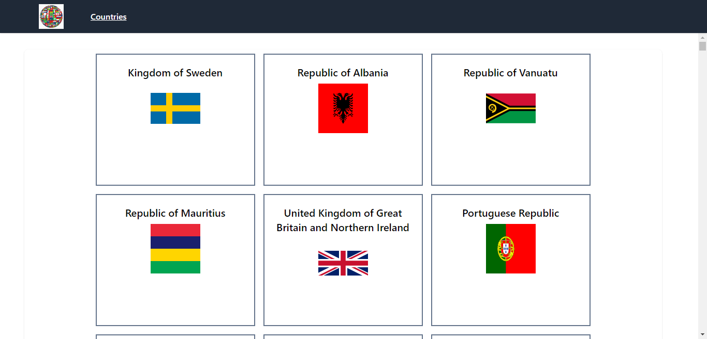
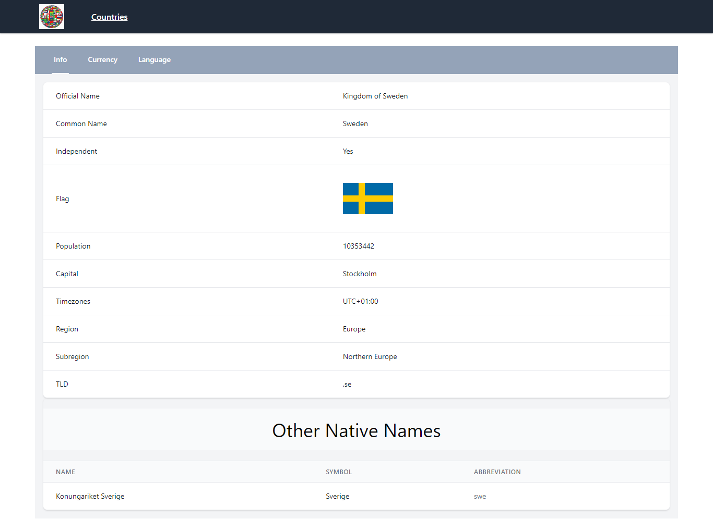

## APP: [https://agile-everglades-89113.herokuapp.com/](https://agile-everglades-89113.herokuapp.com/)

----------------------------------------

# country-web
Country listing Web application made up with react v18 (hooks) and react-router v6. 


#### Tech Stack
     axios: 0.25.0
     react: ^18.2.0
     react-redux: ^9.1.0
     react-router-dom: ^6.22.0
     react-scripts: 5.0.1
     @reduxjs/toolkit: ^2.1.0

___
### Running the WebApp Locally
````
$ git clone https://github.com/mabc224/react-country-app.git
$ cd react-country-app

Add `.env` file with environment variables. You can check `.env_example`

$ npm install
$ npm start
````
Then visit `localhost:3000` in your browser.

### Screenshot






